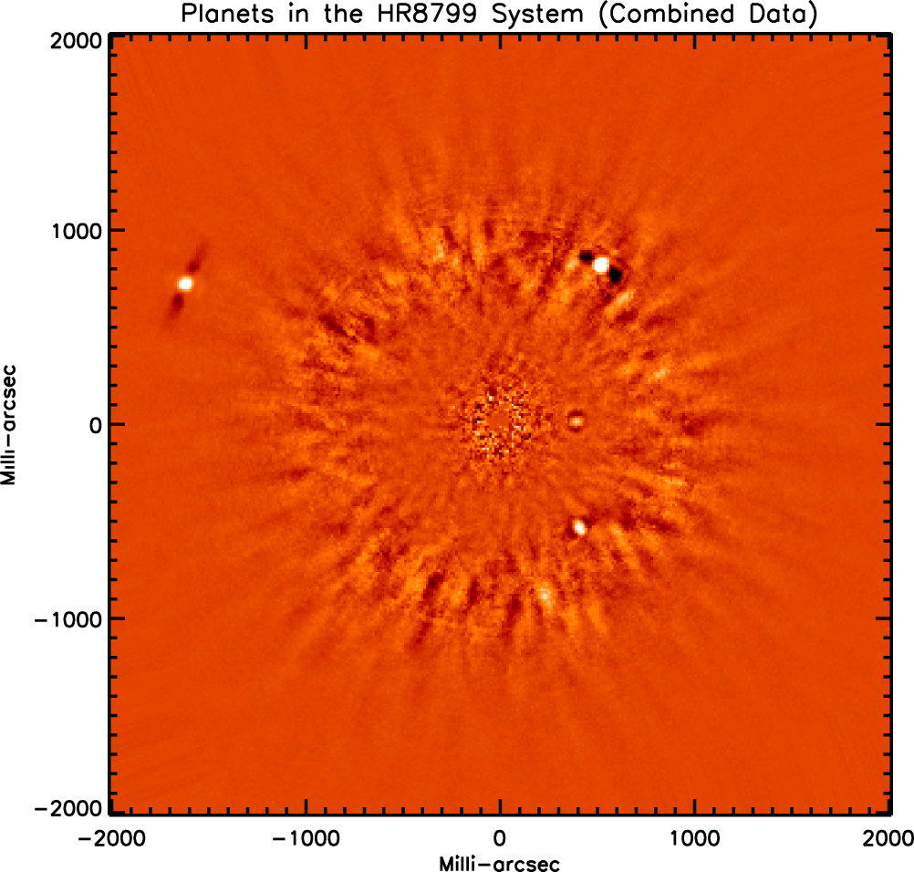

## README

This algorithm is used for the detection of exoplanets in high contrast environments. Full details regarding the algorithm and it's implementation can be found in https://iopscience.iop.org/article/10.3847/0004-637X/820/1/40/meta. 

*Directly imaged planets, shown in white, in the HR8799 stellar system. This code was used to remove speckles caused by imperfections in the telescope optics while keeping the signal from planets.* 

#### Overview of Functions

**Search_zones.pro –** Function inputs PSF cube, ring width (in pixels), and number of angular segments. The output is a structure containing two elements: “ringseg” and “mask_index”. Ringseg is a 4d array containing the data for a given image/ring/angle segment. Mask_index keeps track of where each segment is located on the image; the reason mask_index is required is due to the fact that the “ringseg” data is made compact via matrix_reduce.pro (for memory considerations) and we lose the indexing information (necessary to recreate the final image) at that point.

**KLIP.pro –** Function that inputs the previous structure from search_zones.pro, the dimension of the PSF subarray in pixels, and the number of basis vectors (k_klip) to retain. The output is the PSF subtracted image. (NOTE: the target image that is projected onto the KL basis is just the first image in the original PSF cube).

**Get_klip_basis.pro –** This is a function called within KLIP.pro that returns the KL basis (as column vectors of array) for the PSF library.

**Reduce_matrix.pro –** Function called within KLIP.pro that takes the large data matrix for a given segment and returns a matrix with only finite values. This enables the KLIP algorithm to be performed only on the segment of interest, thus saving memory and avoiding problems handling NaN values.